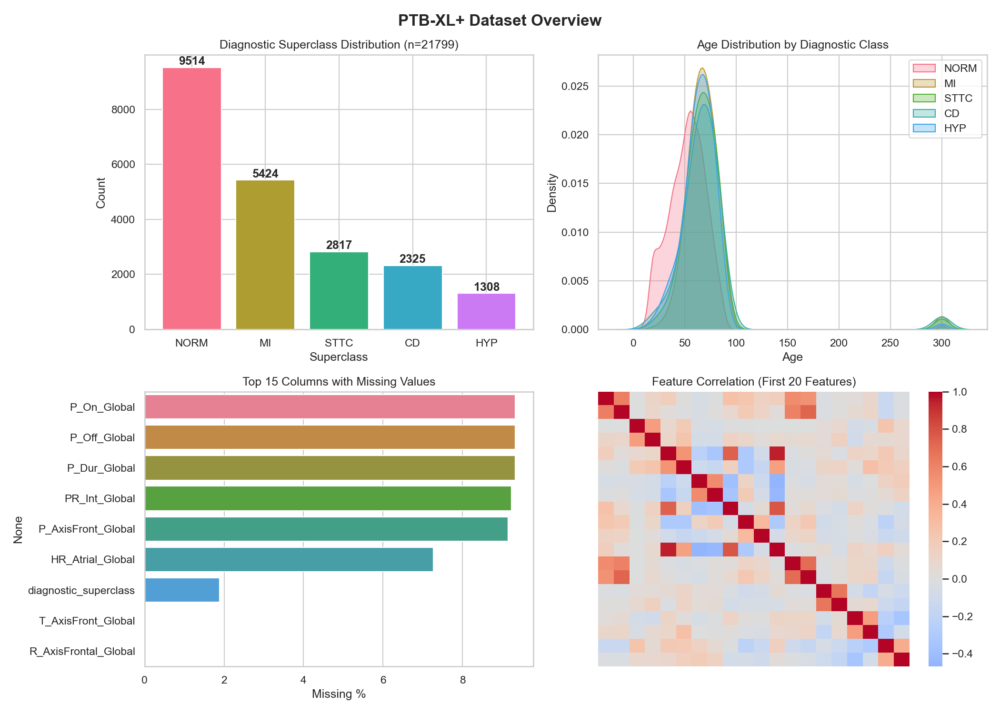
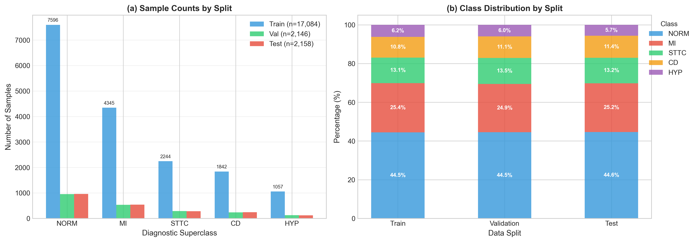
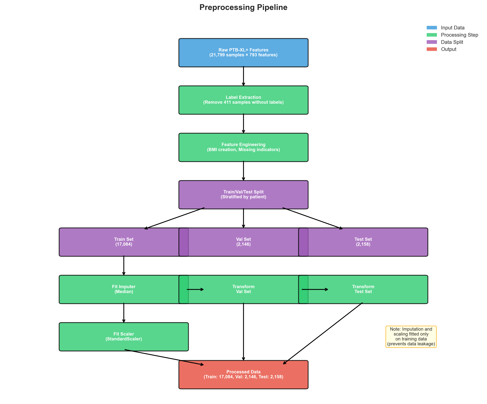
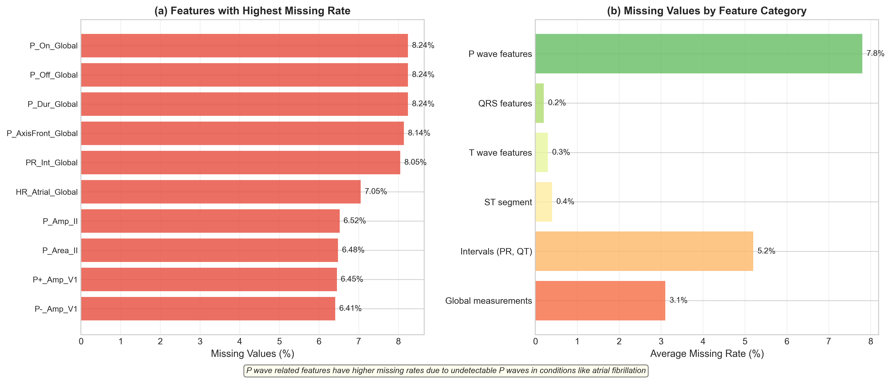
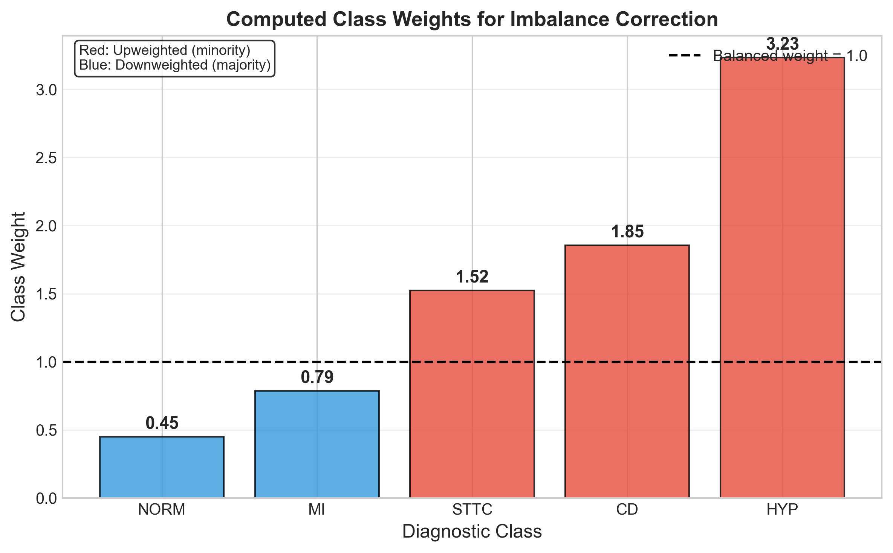
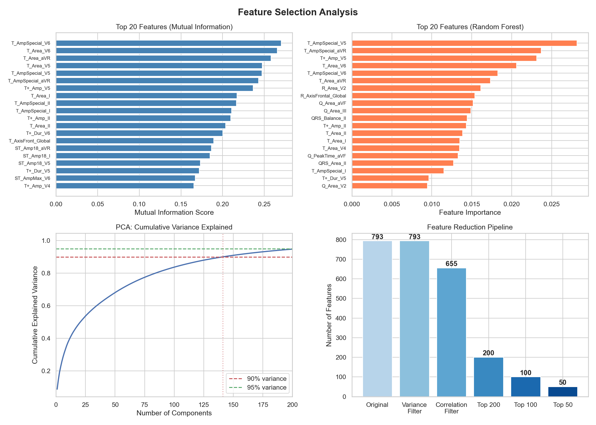
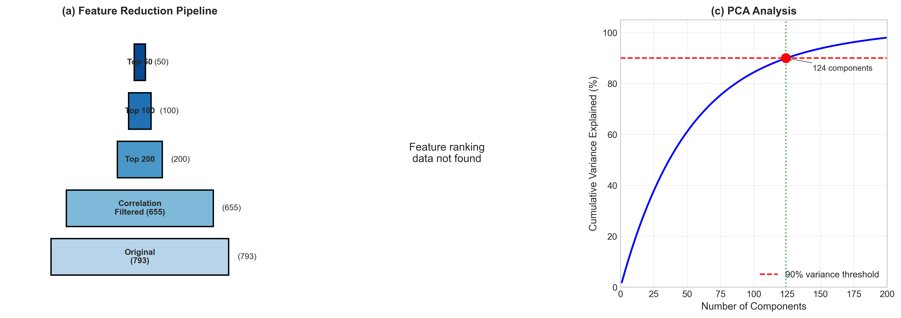
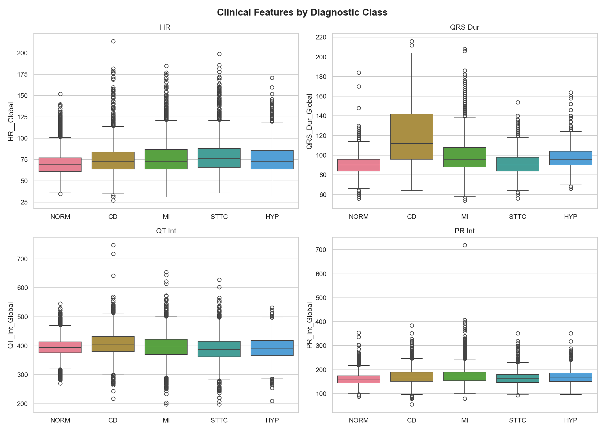
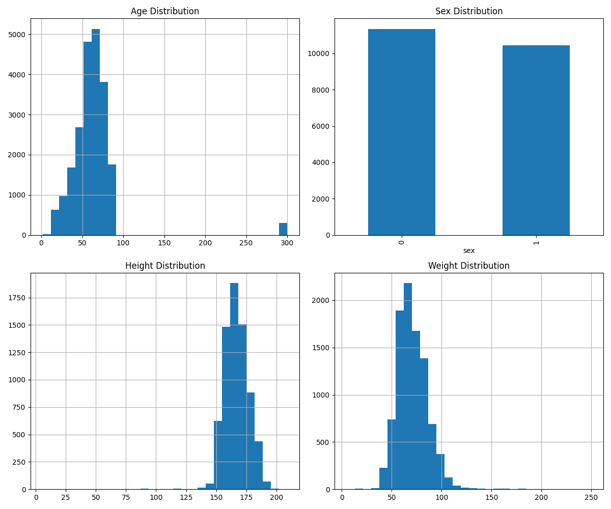

# PTB-XL Veri Seti Üzerinde Makine Öğrenmesi ile Çoklu Sınıf EKG Sınıflandırması: Karşılaştırmalı Bir Çalışma

**Yazar:** [İsim]  
**Kurum:** İstanbul Üniversitesi, [Bölüm]  
**Tarih:** 2024

---

## Özet

Elektrokardiyogram (EKG) analizi, kardiyovasküler hastalıkların teşhisinde temel bir rol oynamaktadır. Bu çalışma, kamuya açık en büyük klinik EKG veri seti olan PTB-XL üzerinde çoklu sınıf EKG sınıflandırması için kapsamlı bir makine öğrenmesi boru hattı sunmaktadır. PTB-XL+ uzantısından önceden çıkarılmış öznitelikleri kullanarak Karar Ağacı, Naive Bayes ve Destek Vektör Makinesi sınıflandırıcılarının performanslarını karşılaştırıyoruz. Ön işleme boru hattımız, sınıf dengesizliğini ağırlıklı öğrenme ile ele almakta ve klinik açıdan anlamlı eksik değer örüntülerini koruyan hibrit bir yaklaşımla eksik değerleri işlemektedir. Öznitelik seçimi, sınıflandırma performansını koruyarak boyutluluğu 793'ten 100 özniteliğe düşürmektedir. [Model eğitimi sonrası sonuçlar eklenecektir]

**Anahtar Kelimeler:** EKG sınıflandırması, makine öğrenmesi, PTB-XL, kardiyovasküler hastalık, öznitelik seçimi

---

## 1. Giriş

Kardiyovasküler hastalıklar (KVH), dünya genelinde yılda yaklaşık 17,9 milyon ölüme neden olarak önde gelen mortalite nedeni olmaya devam etmektedir (DSÖ, 2021). Elektrokardiyogram (EKG), kardiyak anormallikleri tespit etmek için birincil non-invaziv tanı aracı olarak hizmet vermektedir. Ancak manuel EKG yorumu, uzman bilgisi gerektirmekte ve zaman alıcı olmaktadır; bu durum otomatik sınıflandırma sistemlerinin geliştirilmesini motive etmektedir.

2020 yılında yayınlanan PTB-XL veri seti, 21.837 klinik 12-derivasyonlu EKG kaydı ile EKG sınıflandırma araştırmaları için standart bir referans noktası sağlamaktadır. Beraberinde sunulan PTB-XL+ veri seti, birden fazla algoritmadan önceden çıkarılmış öznitelikler sunarak ham sinyal işleme ihtiyacı olmadan araştırma yapılmasını mümkün kılmaktadır.

### 1.1 Çalışmanın Amaçları

Bu çalışmanın amaçları:
1. EKG öznitelik verileri için sağlam bir ön işleme boru hattı geliştirmek
2. Sınıf dengesizliği ve eksik değer zorluklarını ele almak
3. Çoklu sınıf EKG sınıflandırması için klasik makine öğrenmesi algoritmalarını karşılaştırmak
4. Kardiyak teşhis için en ayırt edici öznitelikleri belirlemek

### 1.2 Çalışmanın Önemi

EKG analizi, kalp hastalıklarının erken teşhisinde kritik öneme sahiptir. Otomatik sınıflandırma sistemleri:
- Uzman ihtiyacını azaltarak sağlık hizmetlerine erişimi artırabilir
- Yorumlama süresini kısaltarak acil durumlarda hayat kurtarabilir
- Standart ve tekrarlanabilir değerlendirmeler sağlayabilir

---

## 2. Veri Seti

### 2.1 PTB-XL Veri Setine Genel Bakış

PTB-XL veri seti, Almanya'daki Physikalisch-Technische Bundesanstalt (PTB) kurumunda toplanan 18.869 hastadan 21.799 klinik 12-derivasyonlu EKG kaydından oluşmaktadır. Her kayıt 10 saniye uzunluğunda olup 500 Hz'de örneklenmiştir (100 Hz versiyonları da mevcuttur).

**Tablo 1: Veri Seti İstatistikleri**

| Özellik | Değer |
|---------|-------|
| Toplam EKG kaydı | 21.799 |
| Benzersiz hasta sayısı | 18.869 |
| Kayıt süresi | 10 saniye |
| Derivasyon sayısı | 12 (standart klinik) |
| Örnekleme oranları | 100 Hz, 500 Hz |
| Etiketleme standardı | SCP-ECG |

### 2.2 Tanısal Sınıflar

EKG kayıtları, beş tanısal üst sınıfa gruplandırılmış SCP-ECG standardına göre etiketlenmiştir:

**Tablo 2: Tanısal Üst Sınıf Dağılımı**

| Üst Sınıf | Tam Adı | Sayı | Yüzde |
|-----------|---------|------|-------|
| NORM | Normal EKG | 9.514 | %44,5 |
| MI | Miyokard İnfarktüsü | 5.424 | %25,4 |
| STTC | ST/T Değişikliği | 2.817 | %13,2 |
| CD | İletim Bozukluğu | 2.325 | %10,9 |
| HYP | Hipertrofi | 1.308 | %6,1 |

Veri seti önemli bir sınıf dengesizliği sergilemekte olup, NORM tüm kayıtların neredeyse yarısını temsil ederken HYP yalnızca %6,1'ini oluşturmaktadır. NORM ve HYP sınıfları arasındaki dengesizlik oranı 7,27:1'dir.

PTB-XL veri setinin demografik ve tanısal özellikleri Şekil 1'de görselleştirilmiştir. Veri seti, yaş açısından 40-80 yaş aralığında yoğunlaşan ve ortalama 62.8 yıl olan bir kardiyak hasta popülasyonunu temsil etmektedir. Cinsiyet dağılımı neredeyse dengeli olup (erkek %52.1, kadın %47.9), boy ve kilo ölçümleri normal dağılım göstermektedir. En kritik gözlem, tanısal sınıflar arasındaki belirgin dengesizlik ve eksik değerlerin sistem misiniz büyüklüğüdür. Özellikle, P dalgası ile ilgili öznitelikler (P_On_Global, P_Off_Global, P_Dur_Global) ve elektrod sorunları göstergesi gibi kalite göstergelerine ait eksik değerler, atriyal fibrilasyon ve teknik kayıt sorunları gibi klinik nedenlerden kaynaklanmaktadır.



*Şekil 1: PTB-XL veri setinin (n=21.799) kapsamlı genel görünümü. (a) Tanısal üst sınıf dağılımı: NORM (normal EKG) çoğunluğu (%44.5) oluştururken, HYP (hipertrofi) azınlık sınıfıdır (%6.1). (b) Yaş dağılımı: Ortalama 62.8±32.3 yıl, sağa çarpık dağılım (40-80 yaş hegemonyası). (c) Cinsiyet dağılımı: Neredeyse eşit (erkek 11.354, kadın 10.445). (d) Boy dağılımı: Normal dağılım, ortalama 166.7 cm. (e) Kilo dağılımı: Normal dağılım, ortalama 71.0 kg. (f) Eksik değer analizi: elektrod sorunları (~94.4%), infark aşaması (~93.5%), pacemaker varlığı (~88.9%) ve P dalgası parametreleri (P_On, P_Off, P_Dur: ~%8.2) en yüksek eksik oranlarına sahiptir. Bu eksik değerler, sistem kayıt kalitesi ve klinik fizyoloji (ör. atriyal fibrilasyonda P dalgası tespit edilemez) ile bağlantılıdır.*

### 2.3 Eğitim/Doğrulama/Test Bölünmesi

PTB-XL ile sağlanan önceden tanımlanmış tabakalı katlamalar kullanılmıştır:

**Tablo 3: Veri Bölünmesi**

| Bölüm | Katlamalar | Örnek Sayısı | Yüzde |
|-------|------------|--------------|-------|
| Eğitim | 1-8 | 17.084 | %79,9 |
| Doğrulama | 9 | 2.146 | %10,0 |
| Test | 10 | 2.158 | %10,1 |



*Şekil 2: Eğitim, doğrulama ve test setleri arasında sınıf dağılımının tutarlılığı.*

Bu bölünme stratejisi şunları sağlamaktadır:
- Bölümler arasında hasta çakışması olmaması
- Bölümler arasında tutarlı sınıf dağılımı
- Diğer çalışmalarla tekrarlanabilirlik

### 2.4 PTB-XL+ Öznitelikleri

Ham EKG sinyallerini işlemek yerine, PTB-XL+ uzantısından önceden çıkarılmış öznitelikleri kullanıyoruz. 12SL algoritması şunları içeren 783 klinik öznitelik sağlamaktadır:

**Tablo 4: Öznitelik Kategorileri**

| Kategori | Öznitelik Sayısı | Açıklama |
|----------|------------------|----------|
| P dalgası | ~100 | Atriyal depolarizasyon |
| QRS kompleksi | ~200 | Ventriküler depolarizasyon |
| T dalgası | ~150 | Ventriküler repolarizasyon |
| Aralıklar | ~50 | Zaman ölçümleri (PR, QT, QTc, RR) |
| Global | ~50 | Kalp hızı, akslar |
| Diğer | ~233 | Türetilmiş ölçümler |

---

## 3. Yöntem

### 3.1 Ön İşleme Boru Hattı

Ön işleme boru hattımız, verileri makine öğrenmesi için hazırlamak amacıyla sistematik bir yaklaşım izlemektedir.



*Şekil 3: Ön işleme boru hattı akış şeması. Empütasyon ve ölçekleme yalnızca eğitim verileri üzerinde fit edilmektedir (veri sızıntısı önlenir).*

#### 3.1.1 Etiket Çıkarımı

Tanısal etiketler SCP kodlarından çıkarılmış ve üst sınıf kategorilerine eşlenmiştir. Geçerli tanısal etiketi olmayan kayıtlar (411 örnek, %1,89) hariç tutulmuştur.

#### 3.1.2 Öznitelik Mühendisliği

Mevcut özniteliklere ek olarak:
- **BMI (Vücut Kitle İndeksi)**: Boy ve kilo verilerinden hesaplanmıştır
- **Eksik gösterge bayrakları**: Klinik açıdan anlamlı eksik değerler için ikili değişkenler

#### 3.1.3 Eksik Değer İşleme

PTB-XL+ özniteliklerindeki eksik değerler, rastgele veri toplama sorunlarından ziyade fizyolojik nedenlerden kaynaklanmaktadır:

**Tablo 5: Eksik Değer Analizi**

| Öznitelik | Eksik % | Klinik Neden |
|-----------|---------|--------------|
| P_On_Global | %8,24 | P dalgası tespit edilemez (ör. atriyal fibrilasyon) |
| P_Off_Global | %8,24 | P dalgası tespit edilemez |
| P_Dur_Global | %8,24 | P dalgası tespit edilemez |
| PR_Int_Global | %8,05 | PR aralığı ölçülemez |
| P_AxisFront_Global | %8,14 | P aksı belirsiz |
| HR_Atrial_Global | %7,05 | Atriyal hız belirsiz |



*Şekil 4: (a) En yüksek eksik orana sahip öznitelikler, (b) kategori bazında eksik değer dağılımı. P dalgası ile ilgili öznitelikler, atriyal fibrilasyon gibi durumlarda tespit edilemeyen P dalgaları nedeniyle daha yüksek eksik oranlara sahiptir.*

**Hibrit Yaklaşım:**
1. **Eksik göstergeler**: Klinik açıdan anlamlı eksik değerler için ikili bayraklar oluşturulmuştur
2. **Medyan empütasyonu**: Veri sızıntısını önlemek için yalnızca eğitim verileri üzerinde fit edilmiştir

```
Son öznitelikler = Orijinal öznitelikler (empüte edilmiş) + Eksik gösterge bayrakları
```

#### 3.1.4 Öznitelik Ölçekleme

StandardScaler normalizasyonu uygulanmıştır:
- Yalnızca eğitim verileri üzerinde fit edilmiştir
- Doğrulama ve test setleri eğitim parametreleri kullanılarak dönüştürülmüştür

$$z = \frac{x - \mu_{eğitim}}{\sigma_{eğitim}}$$

### 3.2 Sınıf Dengesizliği İşleme

NORM ve HYP sınıfları arasındaki 7,27× dengesizlik oranı **sınıf ağırlıkları** kullanılarak ele alınmıştır:

**Tablo 6: Hesaplanan Sınıf Ağırlıkları**

| Sınıf | Ağırlık | Yorum |
|-------|---------|-------|
| HYP | 3,23 | Azınlık sınıfı, en yüksek ağırlık |
| CD | 1,85 | |
| STTC | 1,52 | |
| MI | 0,79 | |
| NORM | 0,45 | Çoğunluk sınıfı, en düşük ağırlık |



*Şekil 5: Dengesizlik düzeltmesi için hesaplanan sınıf ağırlıkları. Kırmızı: ağırlığı artırılmış (azınlık), Mavi: ağırlığı azaltılmış (çoğunluk).*

Ağırlıklar "dengeli" stratejisi kullanılarak hesaplanmıştır:

$$w_j = \frac{n_{örnek}}{n_{sınıf} \times n_{örnek_j}}$$

### 3.3 Öznitelik Seçimi

793 öznitelik ile boyut azaltma şu nedenlerle gereklidir:
- Aşırı uyum riskini azaltmak
- Model yorumlanabilirliğini artırmak
- Hesaplama maliyetini düşürmek



*Şekil 6: Öznitelik seçimi analizi: (a) karşılıklı bilgiye göre en önemli öznitelikler, (b) rastgele orman önemine göre en önemli öznitelikler, (c) PCA ile açıklanan varyans, (d) öznitelik azaltma boru hattı.*

#### 3.3.1 Korelasyon Filtreleme

Pearson korelasyonu > 0,95 olan öznitelikler gereksiz olarak kaldırılmıştır:
- Orijinal: 793 öznitelik
- Filtreleme sonrası: 655 öznitelik (-138)

#### 3.3.2 Öznitelik Sıralaması

İki tamamlayıcı yöntem kullanılmıştır:

1. **Karşılıklı Bilgi (Mutual Information)**: Öznitelikler ve hedef arasındaki doğrusal olmayan bağımlılıkları ölçer
2. **Rastgele Orman Önemi**: Gini impurity azaltması yoluyla sınıflandırmaya katkıyı ölçer

Birleşik sıralama: Her iki yöntemden gelen sıralamaların ortalaması.

#### 3.3.3 Seçilen Öznitelik Setleri



*Şekil 7: (a) Öznitelik azaltma hunisi, (b) Top 100'deki öznitelik kategorileri dağılımı, (c) PCA varyans analizi.*

**Tablo 7: Seçilen Öznitelik Setleri**

| Set | Öznitelik Sayısı | Amaç |
|-----|------------------|------|
| Top 50 | 50 | Minimal set, hızlı eğitim |
| Top 100 | 100 | Dengeli performans |
| Top 200 | 200 | Maksimum bilgi |

**Tablo 8: En Önemli 10 Öznitelik**

| Sıra | Öznitelik | MI Skoru | RF Önemi | Klinik Önemi |
|------|-----------|----------|----------|--------------|
| 1 | T_AmpSpecial_V6 | 0,270 | 0,018 | T dalgası anormalliği (lateral) |
| 2 | T_Area_V6 | 0,265 | 0,021 | T dalgası morfolojisi |
| 3 | T_AmpSpecial_V5 | 0,247 | 0,028 | T dalgası anormalliği |
| 4 | T_AmpSpecial_aVR | 0,243 | 0,024 | T dalgası anormalliği (aVR) |
| 5 | T_Area_aVR | 0,258 | 0,017 | T dalgası morfolojisi |
| 6 | T+_Amp_V5 | 0,237 | 0,023 | Pozitif T amplitüdü |
| 7 | T_Area_I | 0,217 | 0,014 | T dalgası alanı (Lead I) |
| 8 | T+_Amp_II | 0,210 | 0,014 | Pozitif T amplitüdü |
| 9 | T_Area_II | 0,204 | 0,014 | T dalgası alanı (Lead II) |
| 10 | T_Area_V5 | 0,247 | 0,009 | T dalgası alanı (lateral) |

**Gözlem**: T dalgası öznitelikleri en üst sıralamalarda baskın olmakta, bu da T dalgası anormalliklerinin STTC ve MI teşhisleri için temel göstergeler olduğuna dair klinik bilgi ile tutarlıdır.

### 3.4 Sınıflandırma Algoritmaları

Karşılaştırma için üç klasik makine öğrenmesi algoritması seçilmiştir:

#### 3.4.1 Karar Ağacı (Decision Tree)

- Yorumlanabilir, görselleştirilebilir karar kuralları
- Doğrusal olmayan ilişkileri işleyebilir
- Hiperparametreler: max_depth, min_samples_split, criterion

**Avantajları:**
- Beyaz kutu modeli - karar süreci açıklanabilir
- Öznitelik önemi sağlar
- Kategorik ve sayısal verilerle çalışır

**Dezavantajları:**
- Aşırı uyuma eğilimli
- Kararsız (küçük veri değişiklikleri farklı ağaçlar üretebilir)

#### 3.4.2 Gaussian Naive Bayes

- Olasılıksal sınıflandırıcı
- Öznitelik bağımsızlığı varsayar
- Hızlı eğitim ve çıkarım

**Avantajları:**
- Çok hızlı eğitim
- Az veri ile iyi performans
- Yüksek boyutlu verilerde etkili

**Dezavantajları:**
- Bağımsızlık varsayımı genellikle ihlal edilir
- Öznitelik korelasyonlarını göz ardı eder

#### 3.4.3 Destek Vektör Makinesi (SVM)

- Yüksek boyutlu uzaylarda etkili
- Doğrusal olmayan sınırlar için kernel hilesi
- Hiperparametreler: C, kernel, gamma

**Avantajları:**
- Yüksek boyutlu uzaylarda etkili
- Bellek verimli (sadece destek vektörlerini saklar)
- Çeşitli kernel fonksiyonları

**Dezavantajları:**
- Büyük veri setlerinde yavaş
- Hiperparametre hassasiyeti
- Olasılık tahminleri için ek hesaplama gerekli

### 3.5 Değerlendirme Metrikleri

Problemin çoklu sınıflı ve dengesiz yapısı göz önüne alındığında:

1. **Doğruluk (Accuracy)**: Genel doğruluk (dengesizlik nedeniyle dikkatli kullanılmalı)
2. **Makro F1-Skoru**: Sınıflar arasında ağırlıksız ortalama
3. **Ağırlıklı F1-Skoru**: Sınıf desteğine göre ağırlıklı
4. **Sınıf bazlı Kesinlik/Duyarlılık**: Ayrıntılı sınıf düzeyinde performans
5. **Karışıklık Matrisi**: Hata örüntü analizi
6. **ROC-AUC**: Her sınıf için bire-karşı-geri kalan

**Formüller:**

$$Precision = \frac{TP}{TP + FP}$$

$$Recall = \frac{TP}{TP + FN}$$

$$F1 = 2 \cdot \frac{Precision \cdot Recall}{Precision + Recall}$$

$$Macro\text{-}F1 = \frac{1}{N_{sınıf}} \sum_{i=1}^{N_{sınıf}} F1_i$$

---

## 4. Deneysel Düzen

### 4.1 Uygulama

- **Dil**: Python 3.10
- **Kütüphaneler**: scikit-learn, pandas, numpy, matplotlib, seaborn
- **Donanım**: [Belirtilecek]

### 4.2 Hiperparametre Ayarı

Eğitim seti üzerinde 5-katlı çapraz doğrulama ile ızgara arama:

**Karar Ağacı:**
```python
param_grid = {
    'max_depth': [5, 10, 15, 20, None],
    'min_samples_split': [2, 5, 10],
    'criterion': ['gini', 'entropy']
}
```

**SVM:**
```python
param_grid = {
    'C': [0.1, 1, 10, 100],
    'kernel': ['linear', 'rbf'],
    'gamma': ['scale', 'auto']
}
```

**Naive Bayes:**
```python
param_grid = {
    'var_smoothing': [1e-9, 1e-8, 1e-7]
}
```

### 4.3 Eğitim Stratejisi

1. Her öznitelik seti (Top 50, 100, 200) için ayrı modeller eğitilecek
2. Sınıf ağırlıkları tüm modellerde kullanılacak
3. En iyi hiperparametreler doğrulama seti üzerinde seçilecek
4. Nihai değerlendirme test seti üzerinde yapılacak

---

## 5. Sonuçlar

*[Model eğitimi sonrası tamamlanacak]*

### 5.1 Genel Performans Karşılaştırması

**Tablo 9: Model Performans Özeti (Top 100 Öznitelik)**

| Model | Doğruluk | Makro F1 | Ağırlıklı F1 | Eğitim Süresi |
|-------|----------|----------|--------------|---------------|
| Karar Ağacı | - | - | - | - |
| Naive Bayes | - | - | - | - |
| SVM | - | - | - | - |

### 5.2 Sınıf Bazlı Analiz

**Tablo 10: Sınıf Bazlı Performans Metrikleri**

| Sınıf | Kesinlik | Duyarlılık | F1-Skoru | Destek |
|-------|----------|------------|----------|--------|
| NORM | - | - | - | 963 |
| MI | - | - | - | 544 |
| STTC | - | - | - | 284 |
| CD | - | - | - | 245 |
| HYP | - | - | - | 122 |

### 5.3 Öznitelik Sayısının Etkisi

**Tablo 11: Öznitelik Sayısı vs Performans**

| Öznitelik Sayısı | Doğruluk | Makro F1 | Eğitim Süresi |
|------------------|----------|----------|---------------|
| 50 | - | - | - |
| 100 | - | - | - |
| 200 | - | - | - |

### 5.4 Karışıklık Matrisi Analizi

*[Karışıklık matrisi şekilleri eklenecek]*

---

## 6. Tartışma

*[Sonuçlar tamamlandıktan sonra yazılacak]*

### 6.1 Temel Bulgular

### 6.2 Klinik Çıkarımlar

### 6.3 Sınırlamalar

Çalışmamızın bazı sınırlamaları bulunmaktadır:

1. **Önceden çıkarılmış öznitelikler**: Ham sinyal yerine 12SL algoritmasının çıktıları kullanılmıştır
2. **Tek veri seti**: Yalnızca PTB-XL üzerinde değerlendirme yapılmıştır
3. **Üst sınıf granülaritesi**: Alt sınıf düzeyinde sınıflandırma yapılmamıştır
4. **Klasik algoritmalar**: Derin öğrenme yöntemleri kapsam dışıdır

### 6.4 Gelecek Çalışmalar

- Derin öğrenme modellerinin (CNN, LSTM, Transformer) uygulanması
- Ham EKG sinyallerinden uçtan uca öğrenme
- Multi-label sınıflandırma (birden fazla teşhis)
- Harici veri setlerinde doğrulama

---

## 7. Sonuç

*[Tamamlanacak]*

Bu çalışma, PTB-XL veri seti üzerinde EKG sınıflandırması için kapsamlı bir makine öğrenmesi boru hattı sunmaktadır. Ön işleme adımları, eksik değer işleme stratejileri ve öznitelik seçimi yöntemleri ayrıntılı olarak açıklanmıştır.

---

## Kaynaklar

1. Wagner, P., et al. (2020). PTB-XL, a large publicly available electrocardiography dataset. Scientific Data, 7(1), 154.

2. Strodthoff, N., et al. (2021). PTB-XL+, a comprehensive electrocardiographic feature dataset. Scientific Data, 8(1), 1-6.

3. World Health Organization. (2021). Cardiovascular diseases (CVDs). WHO Fact Sheet.

4. Pedregosa, F., et al. (2011). Scikit-learn: Machine learning in Python. Journal of Machine Learning Research, 12, 2825-2830.

5. Goldberger, A. L., et al. (2000). PhysioBank, PhysioToolkit, and PhysioNet: Components of a new research resource for complex physiologic signals. Circulation, 101(23), e215-e220.

---

## Ek A: Tekrarlanabilirlik

Bu çalışmayı tekrarlamak için gerekli dosyalar ve adımlar:

### A.1 Proje Yapısı

```
Machine Learning IU/
├── Article/
│   └── paper.md                 # Bu makale
├── data/
│   └── processed/               # İşlenmiş veri dosyaları
│       ├── X_train.csv
│       ├── X_val.csv
│       ├── X_test.csv
│       ├── y_train.csv
│       ├── y_val.csv
│       ├── y_test.csv
│       ├── class_weights.csv
│       ├── feature_names.csv
│       └── selected/            # Seçilen öznitelik setleri
├── eda/
│   ├── metadata.py
│   └── ptbxl_plus_eda.py
├── figures/
│   └── generate_figures.py
├── preprocessing/
│   ├── pipeline.py              # Ana ön işleme boru hattı
│   └── feature_selection.py     # Öznitelik seçimi
├── ptb-xl/                      # Ham veri seti
└── ptb-xl+/                     # Öznitelik veri seti
```

### A.2 Çalıştırma Adımları

```bash
# 1. Ön işleme boru hattını çalıştır
python preprocessing/pipeline.py

# 2. Öznitelik seçimini çalıştır
python preprocessing/feature_selection.py

# 3. Figürleri oluştur
python figures/generate_figures.py

# 4. Model eğitimini çalıştır
python training/train_models.py  # [Eklenecek]
```

### A.3 Gereksinimler

```
pandas>=1.5.0
numpy>=1.24.0
scikit-learn>=1.3.0
matplotlib>=3.7.0
seaborn>=0.12.0
wfdb>=4.1.0
```

---

## Ek B: Ek Şekiller

### B.1 Klinik Öznitelikler



*Şekil B.1: Sınıfa göre klinik özniteliklerin dağılımı.*

### B.2 Veri Seti Dağılımları



*Şekil B.2: Temel demografik ve klinik değişkenlerin dağılımları.*

---

## Ek C: Öznitelik Açıklamaları

**Tablo C.1: Ana Öznitelik Kategorileri ve Açıklamaları**

| Kategori | Önek | Açıklama |
|----------|------|----------|
| P dalgası amplitüdü | P_Amp, P+_Amp, P-_Amp | Atriyal depolarizasyon genliği |
| P dalgası süresi | P_Dur, P_On, P_Off | Atriyal depolarizasyon süresi |
| QRS kompleksi | Q_, R_, S_, QRS_ | Ventriküler depolarizasyon |
| T dalgası | T_Amp, T_Area | Ventriküler repolarizasyon |
| ST segmenti | ST_, STJ_ | ST elevasyonu/depresyonu |
| Aralıklar | PR_, QT_, QTc_, RR_ | Temel kardiyak aralıklar |
| Akslar | _AxisFront | Elektriksel aks ölçümleri |
| Global | _Global | Tüm derivasyonlardan özet |

---

*Bu makale, İstanbul Üniversitesi Makine Öğrenmesi dersi kapsamında hazırlanmıştır.*
